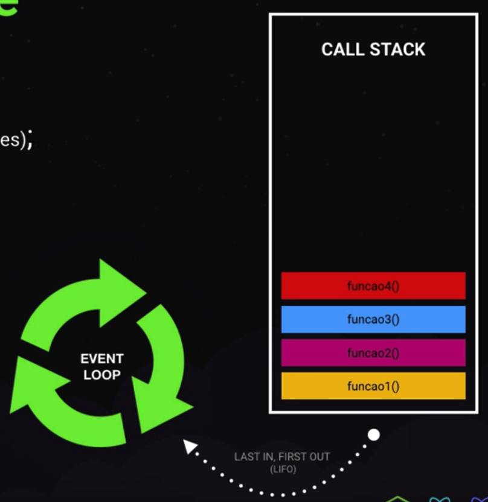

# Conceitos do Node

## O que é o Node.js?

- Javascript no back-end;
  - Não lidamos com eventos do usuário final;
  - Rotas e integrações;
- Plataforma (não linguagem);
- Construída em cima da V8;
- Comparável a PHP / Ruby / Python / Go;

## O que é o NPM?

- Instalar bibliotecas de terceiros;
- Fornecer bibiotecas;
- Por que utilizaremos o Yarn?
  - Ele está avançando mais rápido que o NPM em questão de funcionalidades;
- Comparáveis:
  - Composer do PHP;
  - Gems do Ruby;
  - PIP do Python;

## Características do Node

- Arquitetura Event-loop;
  - Baseada em eventos (Rotas na maioria das vezes);
  - Call Stack;
- Node single-thread;
- C++ por trás com libuv;
- Background threads;
- Non-blocking I/O;

## Frameworks

- ExpressJS como base:
  - Sem opinião;
  - Ótimo para iniciar;
  - Micro-serviços;
- Frameworks opinados:
  - AdonisJS;
  - NestJS;